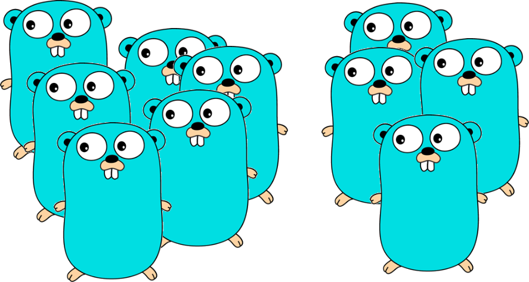

# Gollections - A collections' library for Golang generics


[](https://pkg.go.dev/mod/github.com/totemcaf/gollections)

Gollections is a small library with helper functions and nre types to handle common collections in a type safe manner.

It uses the new generics support in GO that allows to create generic functions and types to let the compiler
check the correct use of types.

# Requirements

This library requires GO 1.18 or newer because it is based on the new generics support.

See https://go.dev/doc/go1.18

# Installation

The recommended way to get started using the Gollections is by using Go modules to install the dependency in your project.

    go get github.com/totemcaf/gollections

When using a version of Go that does not support modules, the library can be installed using dep by running

    dep ensure -add "github.com/totemcaf/gollections"

# Usage

You can see more detail in [API documentation](https://pkg.go.dev/github.com/totemcaf/gollections@v0.3.0-b).

Instead of writing

```go
package main

import "fmt"

func SearchValue(as []string, toSearch string) int {
    for idx, a := range as {
        if a == toSearch {
            return idx
        }
    }
    return -1
}

func main() {
    strings := []string{"hi", "hello", "world"}

    fmt.Printf("%s, found at %d", "hello", SearchValue(strings, "hello"))
}
```

And then repeating for other type, you can now write:

```go
package main

import "fmt"

func SearchValue[A comparable](as []A, toSearch A) int {
    for idx, a := range as {
        if a == toSearch {
            return idx
        }
    }
    return -1
}

func main() {
    strings := []string{"hi", "hello", "world"}

    fmt.Printf("%s, found at %d", "hello", SearchValue(strings, "hello"))

    ints := []int{ 4, 14, 42 }
    fmt.Printf("%d, found at %d", 42, SearchValue(ints, 42))
}
```

And also new generic functions can be used:

```go
package main

import (
    "fmt"

    "github.com/totemcaf/gollections/slices"
)

func main() {
    strings := slices.Of("hi", "Hello", "world")

    fmt.Printf("%s, found at %d", "hello", slices.Index(strings, "hello"))
}
```

Composing the fluent style you can do, for example:

```go
package main

import (
    "fmt"

    "github.com/totemcaf/gollections/slices"
)

func main() {
    words := slices.Of("hi", "Hello", "world")

    wordSize := func(w string) int {return len(w)}
    isLong := func(n int) bool {return n > 4}
    
    longWordCount := slices.Count(slices.Map(words, wordSize), isLong) 

    fmt.Printf("found %d long words", longWordCount)
}
```

Or you can use the `List[T]` type:

```go
package main

import (
    "fmt"

    "github.com/totemcaf/gollections/lists"
)

func main() {
    words := lists.Of("hi", "Hello", "world")

    wordSize := func(w string) int { return len(w) }
    isLong := func(n int) bool { return n > 4 }

    longWordCount := lists.Map(words, wordSize).CountBy(isLong)

    fmt.Printf("found %d long words", longWordCount)

    isLongWord := func(s string) bool { return len(s) > 4 }

    fmt.Printf("another way to found %d long words", words.FilterBy(isLongWord).Count())

    numbers := lists.Of(42, 12, 34, 666)

    square := func(n int) int { return n * n }
    sumOfInts := func(sum, n int) int { return sum + n }

    sumOfSquares := numbers.Map(square).Reduce(sumOfInts)

    fmt.Println("Sum of squares of ints", sumOfSquares)
}
```
